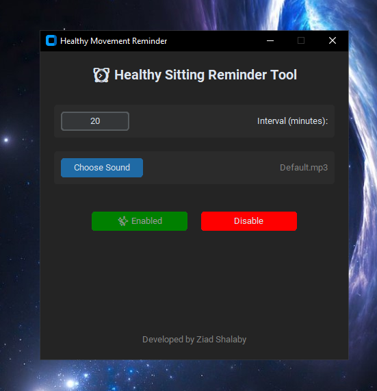

# ⏰ Healthy Movement Reminder for Windows

A lightweight Windows desktop application that reminds you to take a short movement break at regular intervals while working on your computer.

The program runs silently in the background and plays a customizable alarm sound every X minutes (e.g. 20 minutes) to encourage you to stand up, stretch, or move for better health and posture.

It also automatically starts with Windows and continues running until manually disabled.

---

## ✨ Features

- ⏱ Custom time interval (e.g. every 20 minutes)
- 🔊 Custom alarm sound support (MP3 / WAV)
- 🖥 Runs automatically on Windows startup
- ⚡ Lightweight background worker process
- 🔁 Persistent settings using JSON file
- ❌ Easy Enable / Disable control from GUI
- 🔇 Silent background operation (no console window)

---

## ⚙️ How It Works

1. User opens `timer.exe`
2. Sets the reminder interval (e.g. 20 minutes)
3. Selects an alarm sound (optional)
4. Clicks **Enable**
5. The app:
   - Saves settings
   - Starts background worker
   - Adds itself to Windows startup
6. Every interval, a sound plays to remind you to move

You can stop it anytime by clicking **Disable**.

---

## 🚀 How to Use

1. Download and extract the project files
2. Run `timer.exe`
3. Set your preferred time interval
4. (Optional) Choose a custom alarm sound
5. Click **Enable**
6. The app will run in the background and start automatically on Windows startup

To stop it:

- Open the app again
- Click **Disable**

---
